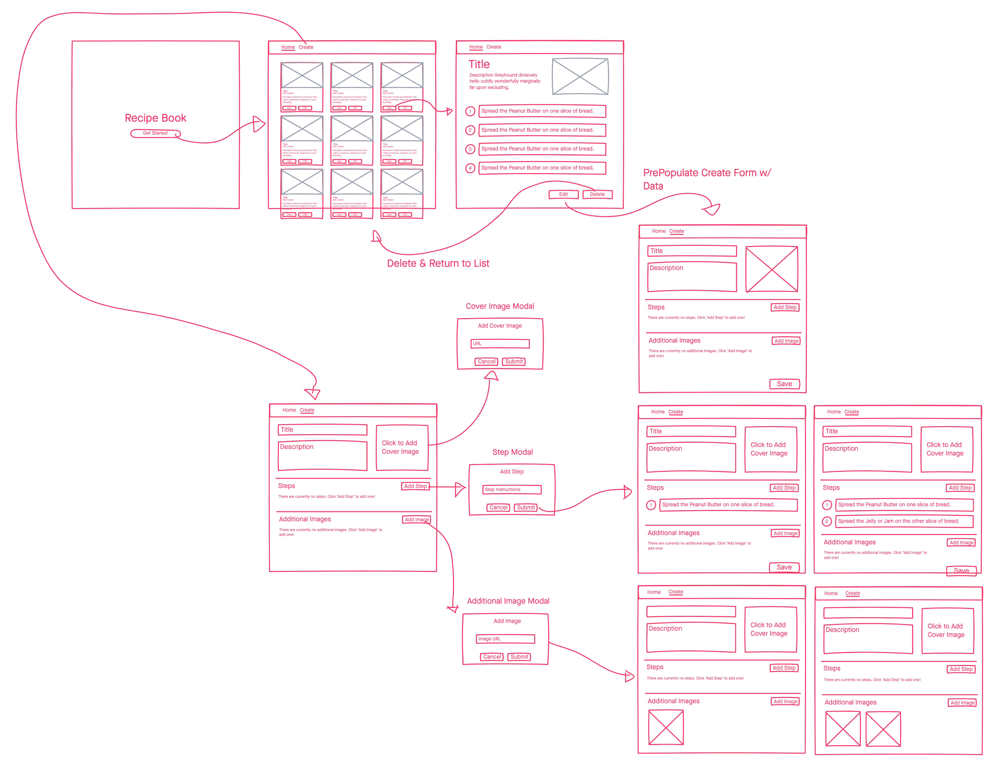

# Give me a heads up for what you would like to see :D
- CRUD NGRX
- ENTITY Simple state management
- Different way to impliment images
- refactoring the code
- 


# Recipe Book FE Challenge

- [Prompt](#prompt)
  * [Suggestions](#suggestions)
- [Mockups](#mockups)
- [User Stories](#user-stories)
- [Install Dependencies](#install-dependencies)
  * [API](#api)
  * [Client](#client)
- [Starting](#starting)
  * [API](#api-1)
    + [Port](#port)
    + [Commands](#commands)
  * [Client](#client-1)
    + [Port](#port-1)
    + [Commands](#commands-1)
- [API Documentation](#api-documentation)
- [Shared Directory](#shared-directory)

---

## Prompt
Create a simple Angular application that allows Users to Create, View (Read), Update and Delete Recipes. If you are unable to 'complete' all of the User Stores, please still submit your work!~

### Suggestions
* In an effort to save time, try to use a Component or UI Library such as [Angular Material](https://material.angular.io/).
* Try to structure your Angular Components in a way that aids in the speed of development.
* ASK QUESTIONS! Be sure to reach out to your hiring team if you have _any questions whatsoever_.

## Mockups
There are some rough mockups that you may use, if you wish, found [here](https://projects.invisionapp.com/freehand/document/ytJybhBLO?origin=v7).

Additionally, there is a single static image of the mockups located at `./mockups`

You _are not required_ to use these designs. Feel free to use a design that you feel better suits the Application, but be prepared to explain those decisions, if necessary.



## User Stories
In `./user-stories` you'll find a number of Markdown (`.md`) files detailing the behaviors that are expected from this challenge.

Check them out [here](./user-stories/index.md).

### User Stories Remaining
| User Story        | Completed |
|-------------------|-----------|
| Landing Page      | x         |
| List View         | x         |
| Details View      | x         |
| Create Recipe     |           |
| Update Recipe     | x         |
| Delete Recipe     |           |
| Additional Images |           |

## Install Dependencies
### API
```bash
cd ./api && yarn
```
or
```bash
cd ./api && npm i
```

### Client
```bash
cd ./client && yarn
```
or
```bash
cd ./client && npm i
```

## Starting
### API
The API for this homework assignment is a very simple JSON file based API, driven by `json-server`. In order to work with the API you'll have to ensure that both the API and Client servers are running simultaneously.

#### Port
The API uses `localhost:4199`, but you can override this in `./api/json-server.json`.

#### Commands

```bash
# From ./api
yarn start
```
or
```bash
# From ./api
npm run start
```

### Client
There already exists a boilerplate Angular application generated by the Angular CLI in `./client`.

#### Port
Default port of `localhost:4200` is used here, but you can override if necessary in any of the typical Angular-y ways.

#### Commands
```bash
# From ./client
yarn start
```
or
```bash
# From ./client
npm run start
```

## API Documentation
In order to complete this challenge you'll likely need to review the API documentation. [Be sure to check out the documentation for json-server](https://www.npmjs.com/package/json-server). There you will find information on how to:

- `GET` a Collection Request
- `GET`, `PUT`, `POST`, and `DELETE` a single entity 
- Filter
- Paginate
- Sort
- Slice
- Full-text search

## Shared Directory
In this directory you'll find some 'shared' models. These models are not consumed in the `api`, because it's not entirely necessary for `json-server` to function. However, this is a common Monorepo style approach to shared models in a Node context, so we've placed them here for your convenience.
```bash
.
└── models
    ├── ingredient.model.ts
    └── recipe.model.ts
```
